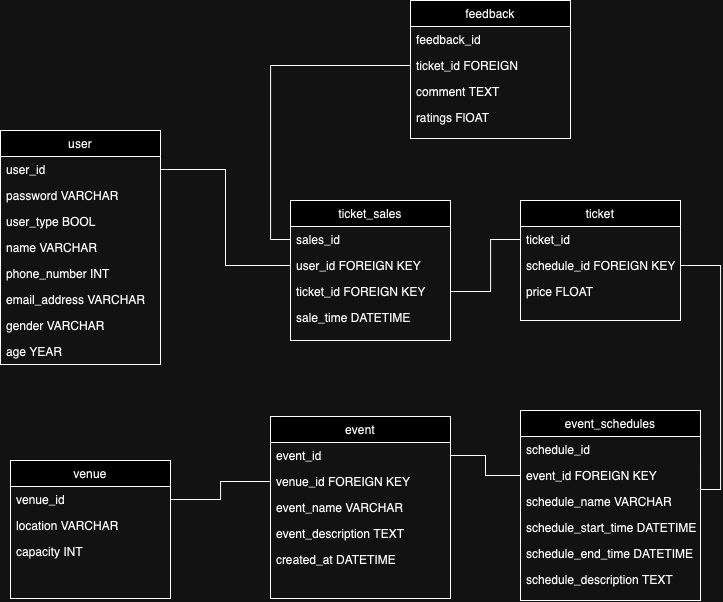

# Event Management System

### About

The Event Management System is a comprehensive application designed to facilitate the management of events, users, tickets, and feedback. The system utilizes a SQLite database to store and manage data efficiently. It allows administrators to manage user accounts, events, venues, ticket sales, and feedback, while also providing users with the ability to view events, purchase tickets, and submit feedback.

### Features

- User Management:
  User Types: Differentiate between admin (user_type: 0) and regular users (user_type: 1).
  Create, read, update, and delete user accounts based on user type.
- Event Management:
  Add, view, update, and delete events and their schedules.
- Venue Management:
  Manage venue details, including location and capacity.
- Ticket Management:
  Handle ticket creation, sales, and cancellations.
- Feedback System:
  Collect and manage user feedback on events.
- Reporting and Analytics:
  Generate reports and analyze ticket sales and user activities.

### Schema

The following is a high-level overview of the database schema used in the Event Management System:

### Solution Architecture

The system architecture consists of the following components:
Database: SQLite database (project_database.db) to store all relevant data.
Backend Logic: Python scripts to handle business logic, database interactions, and user authentication.
User Interface: Command-line interface for user interactions.

### Usage

Upon running the application, users can choose from the following options:
User Management: Admins can manage user accounts.
Event Management: Admins can manage events and their schedules.
Venue Management: Admins can manage venue details.
Ticket Management: Admins can manage ticket sales and cancellations.
Feedback Management: Admins can collect and manage feedback.
Reporting and Analytics: Admins can generate reports and analyze data.
Users can also register, log in, view available events, purchase tickets, and provide feedback on events they attended.

### Tables

1. Users

- user_id (INTEGER, Primary Key): Unique identifier for each user.
- username (TEXT, Unique): The username of the user.
  password (TEXT): The password for user authentication.
  user_type (INTEGER): Type of user (0 for admin, 1 for regular user).

2. Events

- event_id (INTEGER, Primary Key): Unique identifier for each event.
- event_name (TEXT): Name of the event.
- event_date (DATETIME): Date and time of the event.
- venue_id (INTEGER, Foreign Key): Identifier for the venue where the event is held.

3. Venues

- venue_id (INTEGER, Primary Key): Unique identifier for each venue.
- venue_name (TEXT): Name of the venue.
- location (TEXT): Physical address of the venue.
- capacity (INTEGER): Maximum capacity of the venue.

4. Tickets

- ticket_id (INTEGER, Primary Key): Unique identifier for each ticket.
- event_id (INTEGER, Foreign Key): Identifier for the event.
- user_id (INTEGER, Foreign Key): Identifier for the user who purchased the ticket.
- purchase_date (DATETIME): Date and time when the ticket was purchased.

5. Feedback

- feedback_id (INTEGER, Primary Key): Unique identifier for each feedback entry.
- event_id (INTEGER, Foreign Key): Identifier for the event.
- user_id (INTEGER, Foreign Key): Identifier for the user providing feedback.
- rating (INTEGER): Rating given by the user (e.g., 1 to 5 stars).
- comments (TEXT): Additional comments from the user.

6. Relationships

- Users can purchase multiple Tickets.
- Events can have multiple Tickets associated with them.
- Events can receive multiple Feedback entries from users.
- Venues can host multiple Events.

### Tech Stack

Programming Language: Python
  Database: SQLite
  Libraries: sqlite3, datetime, csv
